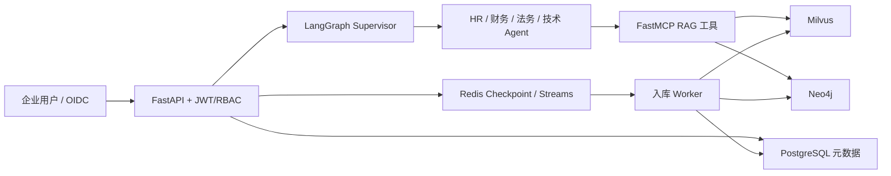

# 企业多智能体 RAG

面向 HR、财务、法务、技术等企业知识场景的多智能体问答系统。系统使用 LangGraph 分层 Supervisor 完成意图识别、动态路由与人工追问，使用 Milvus、Neo4j 和重排序完成授权范围内的混合检索，并按文档特征选择本地解析、OCR、视觉模型或云解析器。

## 当前能力

- 身份与权限：Bearer JWT，支持 OIDC/JWKS 或 RSA 公钥校验；接口按 `chat:use`、`kb:read`、`kb:write`、`kb:delete` 执行 RBAC。
- 租户隔离：API、PostgreSQL 元数据、LangGraph thread、Milvus 和 Neo4j 检索均绑定 `tenant_id`；检索执行 `tenant AND (owner OR ACL)`。
- 状态机：Supervisor 支持跨域 fan-out、Human-in-the-Loop、汇总与审核；新一轮会清理旧轮终态，重试耗尽进入失败态。
- RAG：Milvus/Neo4j 双路检索、稳定节点 ID、授权后置复核、结果去重融合、双写失败显式上报、完整删除。
- 文档：流式限量上传、扩展名与文件签名校验、分片续传、确定性解析文件路径、异步入库。
- 可靠性：PostgreSQL 元数据、Redis Streams Worker、重试与死信、Alembic 迁移、真实 readiness、结构化日志和 Prometheus 指标。
- 交付：精确依赖与 `uv.lock`、多阶段 Dockerfile、Compose、GitHub Actions、后端测试与前端构建检查。

## 架构



主工程目录：

- `multi_domain_enterprise_project/main.py`：FastAPI、SSE、上传、知识库管理和健康检查。
- `multi_domain_enterprise_project/worker.py`：Redis Streams 入库与删除 Worker。
- `multi_domain_enterprise_project/agent/`：Supervisor 和领域 Agent。
- `multi_domain_enterprise_project/rag/`：解析、切片、授权检索、融合和双后端读写。
- `multi_domain_enterprise_project/mcp_server/`：带 JWT 校验的 RAG MCP 服务。
- `frontend/`：React + TypeScript 企业工作台。
- `evals/`：量化实验脚本与中文报告。

`chain_graph/` 和 `algorithm/` 仅为学习代码，不是生产入口；包含历史明文凭据的样例已删除。

## 本地启动

项目默认使用 Conda 的 `rag` 环境。首次运行：

```powershell
conda activate rag
python -m pip install uv==0.11.29
python -m uv sync --frozen --active --dev
python scripts/generate_dev_keys.py --if-missing
Copy-Item .env.example .env
```

开发模式使用 SQLite；Redis、Milvus、Neo4j 和 Ollama 需要提前启动。Ollama 至少需要 `qwen3-embedding:4b`，GraphRAG 还需要配置 `QWEN_API_KEY`。

```powershell
python -m alembic upgrade head
python -m multi_domain_enterprise_project.mcp_server.run_mcp
python -m multi_domain_enterprise_project.worker
python -m multi_domain_enterprise_project.main
```

浏览器访问 [http://127.0.0.1:8080](http://127.0.0.1:8080)。开发模式前端会从 `/api/auth/development-token` 获取短期令牌；生产模式该接口固定返回 404。

## 生产部署

生产环境禁止 development JWT 和 SQLite。准备独立公钥、PostgreSQL/Neo4j/MinIO 密码与外部 Ollama 后：

```powershell
$env:AUTH_ISSUER='https://id.example.com/'
$env:AUTH_AUDIENCE='rag-upper-api'
$env:AUTH_PUBLIC_KEY_HOST_PATH='D:\secrets\jwt-public.pem'
$env:POSTGRES_PASSWORD='<strong-password>'
$env:NEO4J_PASSWORD='<strong-password>'
$env:MINIO_PASSWORD='<strong-password>'
$env:QWEN_API_KEY='<dashscope-api-key>'
$env:LLAMA_PARSE_API_KEY='<llama-cloud-api-key>'
$env:RERANKER_MODEL_HOST_PATH='D:\models\bge-reranker-v2-m3'
docker compose up -d --build
```

OIDC 推荐改用 `AUTH_MODE=oidc` 和 `AUTH_JWKS_URL`。生产发布、备份和回滚步骤见 [部署与运维手册](docs/部署与运维手册.md)，当前企业化边界及剩余工作见 [企业化改造与上线清单](docs/企业化改造与上线清单.md)。

## 验证

```powershell
python scripts/secret_scan.py
python -m pytest
python -m ruff check config multi_domain_enterprise_project/core multi_domain_enterprise_project/main.py multi_domain_enterprise_project/worker.py tests
cd frontend
npm ci
npm run typecheck
npm run build
```

运行时探针：

- `/api/health/live`：进程存活。
- `/api/health/ready`：数据库、Redis、checkpointer、Milvus、Neo4j、Ollama 和 MCP 均可用才返回 200。
- `/metrics`：Prometheus 指标。

## 量化实验

统一口径见 [最终简历量化指标汇总](evals/reports/final_resume_metrics.md)，实验设计见 [企业多智能体 RAG 项目量化实验方案](EVALUATION_PLAN.md)。数据与结论如下：

| 模块 | 数据与基线 | 结果 |
| --- | --- | --- |
| 路由 | 120 条脚本标注企业样本；单层 LLM 路由 | 80.83% 到 96.67%，相对提升 19.60% |
| 多跳检索 | MultiHop-RAG 755 条 holdout；文档级向量检索 | Recall@10 由 78.97% 到 96.61%，相对提升 22.34% |
| 表格解析 | 脚本控制样本；固定本地快速解析 | 保留分数 66.67% 到 100%，相对提升 49.99% |
| 公开解析补充 | PubTables-1M OTSL test 抽样 50 条 | 自动路由表格保留分数 86.94% |
| 成本代理 | 30 条控制样本；固定云解析 | 云解析调用 30 次降到 0 次 |

注意：`22.34%` 来自 chunk 候选生成、BM25 和监督式 LambdaMART 的离线实验，不应写成“仅由 Milvus + Neo4j 双路检索带来”。成本数字是云调用次数，不是真实账单金额。

## 简历写法

> 基于 LangGraph 构建分层多智能体系统，实现意图识别、动态路由与 Human-in-the-Loop；在 120 条企业路由集上，相较单层 LLM 路由准确率提升 19.60%。

> 构建租户隔离的 Milvus + Neo4j 混合 RAG，并通过 chunk 候选召回、BM25 与 LambdaMART 重排序，在 MultiHop-RAG 755 条 holdout 上将 Recall@10 从 78.97% 提升至 96.61%（相对提升 22.34%）。

> 设计文档解析路由，动态选择 PyMuPDF、MarkItDown、RapidOCR、Qwen2.5-VL 与 LlamaParse；控制样本表格保留分数提升 49.99%，PubTables-1M 50 条公开样本达到 86.94%，云解析调用由 30 次降至 0 次。

> 使用 FastAPI SSE、JWT/OIDC、RBAC、PostgreSQL、Redis Streams 与 MCP，实现多租户会话隔离、异步入库、失败重试、死信和可观测部署。

## 安全说明

当前工作树已通过跟踪文件凭据扫描，但旧 Git 历史曾包含凭据。必须先在对应平台吊销并轮换，再按 [安全说明](SECURITY.md) 处理历史；普通提交无法删除已经公开的历史对象。
